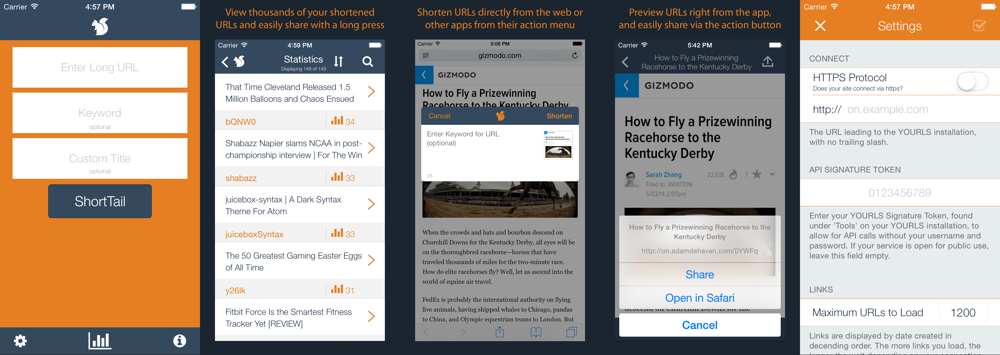

#ShortTail for YOURLS
ShortTail is an elegant, easy-to-use YOURLS client that talks to your server through an integrated API to shorten web links using your branded domain. 

To use ShortTail, you must be running a YOURLS installation on an active domain. For more info, please visit [yourls.org](http://yourls.org)

> ### Update March 2016
> While the app is [no longer "technically" supported or available](http://adamdehaven.com/blog/2015/10/dropping-support-for-shorttail-for-yourls/) in the App Store, I have decided to release the source code under the MIT License. **I just ask that you don't charge for projects resulting from use, and give me credit when due.**

> #### Issues & Pull Requests Welcome
> If you do something cool with the source (e.g. update it for the latest version of iOS, translate into your language, etc.) feel free to [open an issue on GitHub](https://github.com/adamdehaven/ShortTail-for-YOURLS/issues) or submit a Pull Request!



###What's New in v1.6.5:
* Added accessibility features to support VoiceOver
* UI Improvements
* Updated supporting libraries

=====

##Features: 
* Shorten URLS using your branded URL and a YOURLS installation on your active domain 
* View statistics for previously shortened URLs 
* Easily share your links without leaving the app! 
* Works with public AND private YOURLS installations! 
* Shorten extension for use inside apps and on the web
* Easy-to-use [custom URL structure](#shorten-extension) to send links directly to ShortTail 
* Convenient mobile Safari [Bookmarklet](#bookmarklet)
* Pick your flavor 

##How Does It Work? 
1. First, simply type or paste the original URL in the **Enter Long URL** field (happens automatically if you first copy the link outside of ShortTail) 
2. Next, enter an optional keyword and title to use for the link. Remember - keep your keywords short with no spaces or punctuation. 
3. All set? Click the ShortTail button. That's it! 

##Why Provide a Keyword? 
Specifying a keyword allows you to create a specific short URL, making it easy for your users to remember the link. Otherwise, YOURLS will create a randomly generated keyword for you.

##Why Provide A Title? 
Specifying a title customizes the default text when sharing the shortened URL. If no title is specified, YOURLS will grab the URL's page title attribute. 

##Quick Share
To quickly share or copy the short URL of a link you have already shortened, press and hold a row in the Statistics view, and then select your desired action the pop-up menu. 

##Shorten Extension
Easily shorten URLs inside apps or in Safari on the web!
1. Press Safari's 'action' button
2. If the ShortTail icon does not appear, click 'More' and turn on the ShortTail activity
3. Press the ShortTail icon
4. Optionally enter in a custom keyword
5. Press Shorten - that's it! 
The link is shortened and automatically copied to your clipboard for pasting into an email, social network post, etc.!

##Bookmarklet
Install an easy-to-use bookmarklet in Safari on your iOS device: 
1. Copy the entire javascript snippet from this link: [javascript](http://on.adamdehaven.com/stb) (shown below)
```javascript
javascript:(function()%7Bjavascript%3Awindow.location.href%3D'ShortTail%3A%2F%2F'%2Bwindow.location.href%7D)();
```
2. In Safari, visit [adamdehaven.com](http://adamdehaven.com) and create a new bookmark. 
3. Open your Safari bookmarks. Tap “**Edit**” and select the bookmark you just made. 
4. Edit the Address of the Bookmark, and paste in the javascript you copied in Step 1. 
5. Next, edit and change the Name of the bookmark to “**ShortTail**” - Done. 

To use the bookmarklet when viewing a webpage in Safari that you'd like to send to ShortTail, simply open your bookmarks, and tap your newly created bookmarklet. This will open ShortTail and automagically paste in the complete URL. 

##Support
Do you have questions? Are there features you'd love to see in the next update? Feel free to reach out on Twitter [@adamdehaven](http://twitter.com/adamdehaven) or [create an issue on GitHub](https://github.com/adamdehaven/ShortTail-for-YOURLS/issues).

##License
Released under the [MIT License](https://github.com/adamdehaven/ShortTail-for-YOURLS/blob/master/LICENSE).

##About YOURLS (from [yourls.org](http://yourls.org))
>YOURLS stands for Your Own URL Shortener, and allows you to run your own URL shortening service (a la TinyURL or bitly). 

>###Features of YOURLS include: 
>* Free and Open Source software. 
>* Private (your links only) or Public (everybody can create short links, fine for an intranet). 
>* Sequential or custom URL keyword. 
>* Awesome stats: historical click reports, referrers tracking, visitors geo-location. 
>* Terrific Plugin architecture to easily implement new features. 
>* Cool developer API 
>* Friendly installer. 
>* Sample files to create your own public interface, and more!
